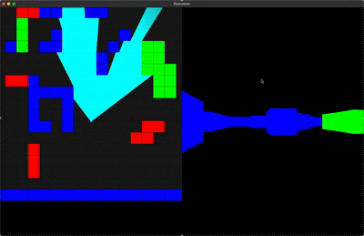

# Nuit

## What is Nuit?

Nuit is a simplistic OpenGL/GLFW wrapper written in modern C++. The library is exported as a single module that can be used simply by doing `import nuit;`. 

**Note**: The Nuit framework only supports macOS and Linux with no planned future support for Windows.

# Enter the Sandbox

The sandbox directory is a collection of programs, ranging from small-to-large demo projects using the Nuit framework.
These are meant to be supplemental reference guides that showcase what you can do with Nuit.

## Raycaster

The Raycaster demo aims to provide a polished application of the Nuit framework.

To edit the level in realtime, use keys `1`, `2`, `3`, and the `space bar`.

Currently, `Q` and `R` are used to rotate the view being cast.



# Getting Started

### Requirements

- CMake 3.28
- Ninja
- Clang 18
- Vcpkg

#### Linux

For linux, run the following commands to install the required packages.

```bash
sudo apt install cmake clang ninja-build
sudo apt install libxmu-dev libxi-dev libgl-dev
sudo apt install libxinerama-dev libxcursor-dev xorg-dev libglu1-mesa-dev pkg-config

sudo apt-get install autoconf automake autoconf-archive
sudo apt-get install curl zip unzip tar
```

#### macOS

On macOS, you need to have homebrew installed in addition to vcpkg.

```bash
brew install ninja cmake llvm
```

#### Setting up the CMakeUserPresets.json

The CMakeUserPresets, while not necessary, is recommended for storing variables for use in the `CMakeLists.txt`. An
example of what it may look like is as follows:

```json
{
  "version": 8,
  "configurePresets": [
    {
      "name": "config",
      "inherits": "abstract",
      "hidden": true,
      "environment": {
        "VCPKG_ROOT": "<PATH TO VCPKG ROOT>"
      },
      "cacheVariables": {
        "BUILD_SANDBOX": "ON"
      }
    },
    {
      "name": "DebugLinux",
      "inherits": [
        "config",
        "Debug"
      ]
    },
    {
      "name": "ReleaseLinux",
      "inherits": [
        "config",
        "Release"
      ]
    }
  ]
}
```